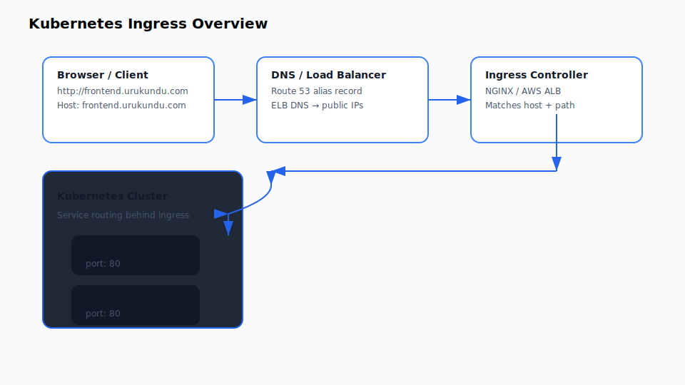

# Kubernetes Ingress Guide

## Overview
This document explains what Kubernetes Ingress does, the practical examples we used today, and how to test both host-based and path-based ingress.

## What is Ingress?
Ingress is a Kubernetes API object that routes external HTTP(S) traffic into services inside the cluster.

- It exposes one or more services using a single load balancer or ingress controller.
- It can route by host name and by path.
- It works with an Ingress controller such as NGINX, AWS ALB Ingress, Traefik, etc.



## Core concepts

### host
- Defines the hostname used in the `Host:` header.
- Example: `frontend.urukundu.com`
- DNS for that host must resolve to the ingress load balancer.
- When the request reaches the ingress controller, it uses `host` to choose the right rule.

### http
- Groups HTTP routing rules for a host.
- Defines one or more `paths` under a host.
- Each path can forward to a different backend service.

### backend
- The destination service inside Kubernetes.
- `service.name` is the Kubernetes Service name.
- `service.port.number` is the port exposed by that Service.

## Practical use cases

### 1) Multiple subdomains (host-based routing)
A single ingress can route different hostnames to different services.

Example:
- `frontend.urukundu.com` → `frontend-service`
- `orders.urukundu.com` → `orders-service`

```yaml
apiVersion: networking.k8s.io/v1
kind: Ingress
metadata:
  name: host-based-ingress
spec:
  ingressClassName: nginx
  rules:
    - host: frontend.urukundu.com
      http:
        paths:
          - path: /
            pathType: Prefix
            backend:
              service:
                name: frontend-service
                port:
                  number: 80
    - host: orders.urukundu.com
      http:
        paths:
          - path: /
            pathType: Prefix
            backend:
              service:
                name: orders-service
                port:
                  number: 80
```

### 2) One domain with multiple services (path-based routing)
A single host can route different URL paths to different services.

Example:
- `urukundu.com/frontend` → `frontend-service`
- `urukundu.com/orders` → `orders-service`

```yaml
apiVersion: networking.k8s.io/v1
kind: Ingress
metadata:
  name: path-based-ingress
spec:
  ingressClassName: nginx
  rules:
    - host: urukundu.com
      http:
        paths:
          - path: /frontend
            pathType: Prefix
            backend:
              service:
                name: frontend-service
                port:
                  number: 80
          - path: /orders
            pathType: Prefix
            backend:
              service:
                name: orders-service
                port:
                  number: 80
```

### 3) Mixed host + path routing
You can also combine both patterns in one ingress:
- `frontend.urukundu.com` → service A
- `urukundu.com/orders` → service B

## Why not use wildcard host in Ingress?
A wildcard host like `*.urukundu.com` can be dangerous because it can become a catch-all route.

Practical problems:
- unrelated traffic may match the wildcard and go to the wrong service
- a single backend may receive all host traffic and become overloaded
- if the service fails, many domains may be affected
- specific host rules may be shadowed by the wildcard

Use exact hosts unless you intentionally want one backend to handle many subdomains.

## Today’s deployment example

### Host-based ingress used today
The real deployed ingress is:

```yaml
apiVersion: networking.k8s.io/v1
kind: Ingress
metadata:
  name: host-based-ingress
spec:
  ingressClassName: nginx
  rules:
    - host: frontend.urukundu.com
      http:
        paths:
          - path: /
            pathType: Prefix
            backend:
              service:
                name: frontend-service
                port:
                  number: 80
    - host: orders.urukundu.com
      http:
        paths:
          - path: /
            pathType: Prefix
            backend:
              service:
                name: orders-service
                port:
                  number: 80
```

### DNS setup used today
Route 53 records for `urukundu.com`:
- `frontend.urukundu.com` → Alias A → `acd212175ed894f479104ac5ffcced63-966285727.us-east-1.elb.amazonaws.com`
- `orders.urukundu.com` → Alias A → `acd212175ed894f479104ac5ffcced63-966285727.us-east-1.elb.amazonaws.com`

The ELB DNS resolves to these public IPs:
- `3.231.32.220`
- `13.216.21.219`

These IPs are the AWS load balancer addresses, not the pod IPs.

## Ingress request flow

### Host-based flow

```
Browser
   |
   | http://frontend.urukundu.com/
   V
DNS resolves frontend.urukundu.com -> ELB DNS -> public LB IP
   |
   V
Ingress Load Balancer (ELB)
   |
   | Host: frontend.urukundu.com
   V
Ingress Controller
   |
   | matches host rule
   V
Service frontend-service
   |
   V
Pod(s) for frontend
```

### Path-based flow

```
Browser
   |
   | http://urukundu.com/orders
   V
DNS resolves urukundu.com -> ELB
   |
   V
Ingress Controller
   |
   | matches host urukundu.com
   | matches path /orders
   V
Service orders-service
   |
   V
Pod(s) for orders
```

## Practical testing

### Check Kubernetes resources
```bash
kubectl get pods,svc,ingress
```

### Internal service test
```bash
kubectl run curl-test --rm -i --restart=Never --image=curlimages/curl \
  --command -- sh -c 'echo TEST frontend; curl -sS http://frontend-service:80/ || true; echo; echo TEST orders; curl -sS http://orders-service:80/ || true'
```

### External host-based test
```bash
curl -H "Host: frontend.urukundu.com" http://acd212175ed894f479104ac5ffcced63-966285727.us-east-1.elb.amazonaws.com/
curl -H "Host: orders.urukundu.com" http://acd212175ed894f479104ac5ffcced63-966285727.us-east-1.elb.amazonaws.com/
```

### External path-based test
```bash
curl -H "Host: urukundu.com" http://acd212175ed894f479104ac5ffcced63-966285727.us-east-1.elb.amazonaws.com/frontend
curl -H "Host: urukundu.com" http://acd212175ed894f479104ac5ffcced63-966285727.us-east-1.elb.amazonaws.com/orders
```

### DNS verification
```bash
nslookup frontend.urukundu.com
nslookup orders.urukundu.com
dig +short acd212175ed894f479104ac5ffcced63-966285727.us-east-1.elb.amazonaws.com
```

## Why the browser failed earlier
- The browser must resolve the hostname before sending traffic.
- `frontend.example.com` was not a public DNS entry for your cluster.
- That is why we switched to `frontend.urukundu.com` and `orders.urukundu.com`.

## Quick reference
- `host` = which hostname the request is for
- `http` = this is HTTP routing logic
- `backend` = the Kubernetes service destination

## Advanced notes
- Use exact hosts for each app when possible.
- Use path-based routing for one domain, many services.
- Avoid wildcard hosts unless you want one backend to handle many domains.
- Route 53 alias records should point to the ELB DNS name, not raw pod IPs.
